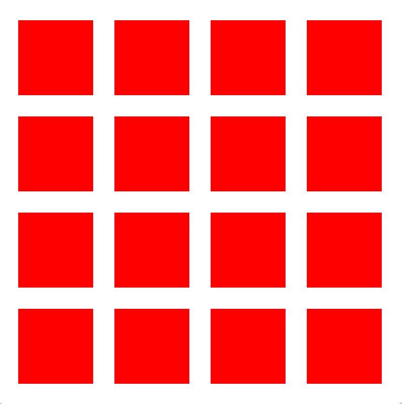
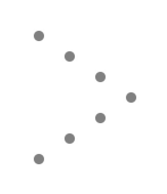
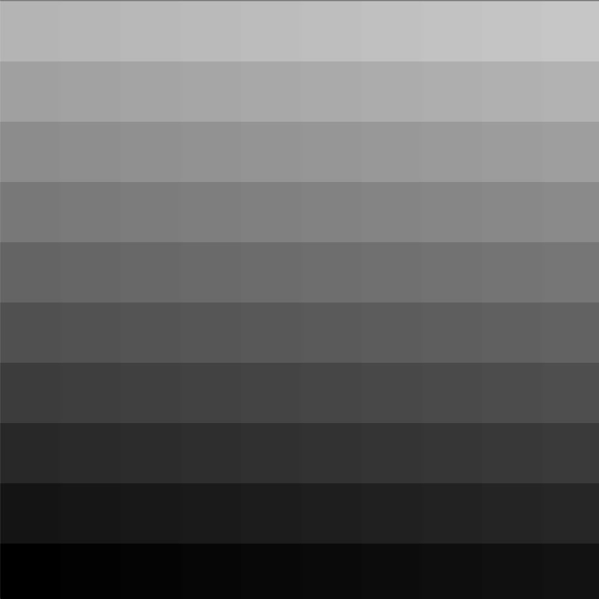
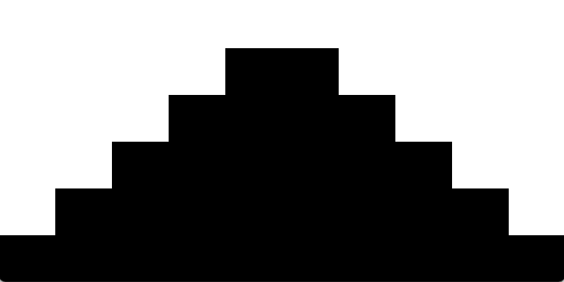
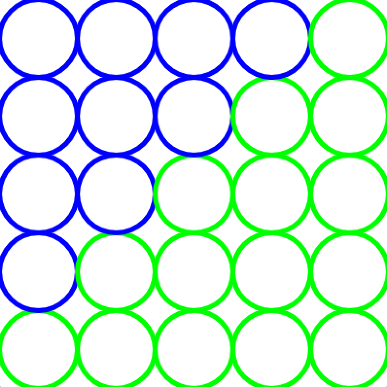

# Task Descriptions
In this file you get the requirements you have to accomplish for each tasks. Hope you have fun solving them!

### Task1
+ Output any string mirrored

### Task 2
+ Display all numbers from 1 to 100 that can be divided by 9 or 6 with a "+".

### Task 3 
+ Output several squares (number according to a variable) in an output window, where a certain distance from the edge is given and the squares must also have the same distance from each other.
+ Example n = 4

### Task 4
+ Replace all the characters with '#' that aren't 's'. This should also work with other characters. So please use a variable 
+ Example: "a1defcaad" -> "#1defc##d"

### Task 5
+ TBA

### Task 6
+  Display the following pattern with StdDraw. Please use a for loop.

    
### Task 7
+ Format a binary number (given as a String) into groups of 4 digits.
+ Example: 11010110101101001 -> 1 1010 1101 0110 1001

### Task 8
+ Draw on a 500x500 canvas square with the color changing from one corner to the other. At the bottom left the square is black and towards the top right the squares become lighter and lighter.

### Task 9 
+ Read a string containing letters and numbers 2, 3 and 4 (e.g. H3ello W4orld). The number in front of the character indicates how often the following character is repeated (H3ello = Heeello).

### Task 10
+ Draw a number of circles. The outermost circle must be grey and the further inside the darker the circle becomes.

### Task 11 - 26 
+ TBA

### Task 27
+ The string "dies ist der erste String in diesem Programm" is given. After each occurrence of a certain character, it should be capitalized how often it occurs!  Maximum it should come up to THREE. That means with the string mentioned above "diEINSes ist dZWEIer DREIerste String in diesem Programm" should come out.

### Task 28
+ Draw a pyramid with n steps. The steps should go up to one side and go down again from the middle.

## Task 29 
+ You read out a string and output it backwards. After that you output the sum of all characters afterwards
+ Example:  Parken => nekraP, 609

### Task 30 
+ Draw n * n circles. In the diagonal the circles should be separated. That means one side should be green and the other side should be blue. The window should be with a fixed width of 400 pixels. The size of the circles should be propertional to the number.

Example n = 5

  
### Task 31 
+ Write a method to sort a numeric array

### Task 32
+ Write a method to sum values of an array

### Task 33
+ Write a method to calculate the average value of array elements

### Task 34
+ Write a method with the name 'findInt(int[] array)' to test if an array contains a specific value. Return of the method should be a boolean

### Task 35
+ Write a Method to insert an element (specific position) into an array. The signature of the Method should be `insertElement(String[] array, int position)` .Please check if the position is valid before inserting!

### Task 36
+ Write a method to find the maximum value of an array in a given interval.
+ For example:
   + 4 2 5 5 1 3 2
   + maximum from interval index 3 - 5 is 3

### Task 37
+ Write a method to remove duplicate elements from an array.

### Task 38
+ Write a method that counts how often an element occurs in an array
+ For example:
   + int[] a = { 3, 5, 4, 6, 6, 2, 3, 4, 2, 3 }
   + countOccurs(a,3)   // should return 3;
   
### Task 39
+ Find the biggest character in a given String and return it

### Task 40
+ Replace a character in a given String with another character
+ Note: do not use the replaceAll method from String -> the goal is to write your own representation of replaceAll

### Task 41
+ Write a method with the signature `fillArray(int[] a)` that fills a array from 10 to 1 (descending)

### Task 42
+ Write a method that gets an integer array and returns the same array with an extra element that is the calculated average of the given array.
+ For example:
  + {1,2,3,4,5,6} -> {1,2,3,4,5,6, 3}
  
### Task 43
+ Write a method that deletes the following character of a String when a certain character is occurring.
 + For example:
    + deleteNext("ABCDEFCG",'C') ---> ABCEFC
 
### Task 44
+ Compare to Strings and find the biggest character at the current positon. Write that bigger character into an array. If one string is bigger than the other one write the rest of the bigger string into that array
 + For example:
    + stringComparer("TestString", "Thats a 2 TestString ABCDEF") ----> ThststringTestString ABCDEF